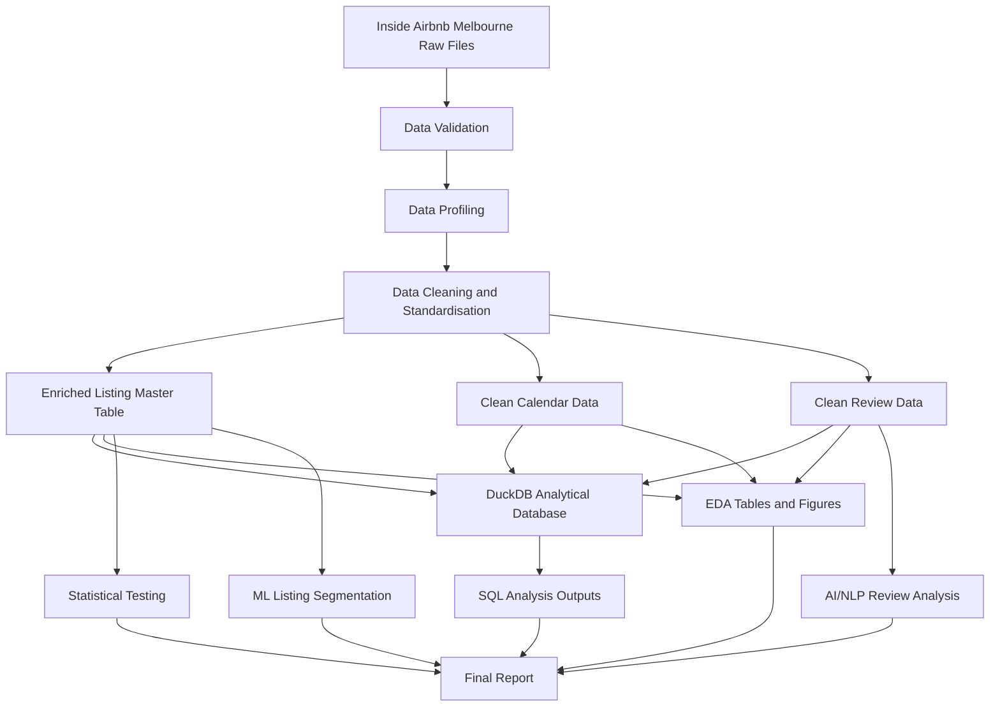

# Airbnb Melbourne Data Engineering and Market Analysis

## Project Overview

This project is a data engineering and analytics assessment using the public Inside Airbnb dataset for Melbourne, Victoria, Australia.

The objective is to build a reproducible data pipeline that ingests raw Airbnb data, profiles data quality, cleans and standardises key fields, creates an enriched listing master table, builds an analytical DuckDB database, runs SQL analysis, generates exploratory data analysis outputs, performs statistical testing, adds a machine learning listing segmentation experiment, and applies lightweight NLP analysis to guest review text.

The project focuses on depth, reproducibility, clear business interpretation, and responsible handling of real-world data limitations for one city rather than attempting many cities superficially.

## Selected City

Melbourne, Victoria, Australia

## Dataset Source

The dataset is sourced from Inside Airbnb.

Files used:

* `listings.csv.gz`
* `listings.csv`
* `calendar.csv.gz`
* `reviews.csv.gz`
* `neighbourhoods.csv`
* `neighbourhoods.geojson`

Raw dataset files are not committed to this repository because they are large and publicly downloadable. Reviewers can download the required Melbourne files from Inside Airbnb and place them in `data/raw/`.

## Project Architecture



## Project Structure

```text
airbnb-data-engineering-project/
│
├── data/
│   ├── raw/
│   ├── processed/
│   └── database/
│
├── reports/
│   ├── ai_outputs/
│   ├── eda_outputs/
│   ├── figures/
│   ├── ml_outputs/
│   ├── sql_outputs/
│   ├── statistical_outputs/
│   ├── ai_usage_disclosure.md
│   ├── decision_log.md
│   ├── final_report.md
│   └── final_report.pdf
│
├── sql/
│   └── analysis_queries.sql
│
├── src/
│   ├── check_data.py
│   ├── profile_data.py
│   ├── clean_data.py
│   ├── build_master_table.py
│   ├── build_database.py
│   ├── run_sql_analysis.py
│   ├── create_eda_outputs.py
│   ├── create_statistical_analysis.py
│   ├── create_ml_experiments.py
│   ├── add_segment_labels.py
│   ├── create_ai_nlp_experiments.py
│   ├── create_report_insights.py
│   ├── build_pdf_report.py
│   └── run_pipeline.py
│
├── requirements.txt
├── README.md
└── .gitignore
```

## Data Setup

Download the Melbourne dataset files from Inside Airbnb and place them in:

```text
data/raw/
```

Expected files:

```text
data/raw/listings.csv.gz
data/raw/listings.csv
data/raw/calendar.csv.gz
data/raw/reviews.csv.gz
data/raw/neighbourhoods.csv
data/raw/neighbourhoods.geojson
```

## Setup Instructions

Create and activate a Python virtual environment.

For Windows PowerShell:

```bash
python -m venv venv
.\venv\Scripts\Activate.ps1
pip install -r requirements.txt
```

For Mac or Linux:

```bash
python3 -m venv venv
source venv/bin/activate
pip install -r requirements.txt
```

## How to Run the Full Pipeline

Run:

```bash
python src/run_pipeline.py
```

This regenerates the processed datasets, DuckDB database, SQL outputs, EDA outputs, figures, statistical outputs, ML segmentation outputs, AI/NLP outputs, and final report insights.

To rebuild only the PDF report after editing `reports/final_report.md`, run:

```bash
python src/build_pdf_report.py
```

## How to Run Individual Pipeline Steps

```bash
python src/check_data.py
python src/profile_data.py
python src/clean_data.py
python src/build_master_table.py
python src/build_database.py
python src/run_sql_analysis.py
python src/create_eda_outputs.py
python src/create_statistical_analysis.py
python src/create_ml_experiments.py
python src/add_segment_labels.py
python src/create_ai_nlp_experiments.py
python src/create_report_insights.py
python src/build_pdf_report.py
```

## Pipeline Summary

The pipeline performs the following steps:

1. Checks that the required raw files exist and can be loaded.
2. Profiles each dataset and creates a data quality report.
3. Cleans listings, calendar, reviews, and neighbourhood data.
4. Builds an enriched `listing_master` table.
5. Builds a DuckDB analytical database.
6. Runs SQL analysis queries.
7. Generates EDA summary tables and visualisations.
8. Generates statistical testing outputs.
9. Runs a K-Means listing segmentation experiment.
10. Adds business labels and interpretations to listing segments.
11. Runs a lightweight NLP review sentiment and theme analysis.
12. Generates report insights and the professional PDF report.

## Analytical Database

The project uses DuckDB as a lightweight analytical database.

The database includes:

* `listing_master`
* `clean_calendar`
* `clean_reviews`
* `dim_host`
* `dim_neighbourhood`
* `dim_room_type`
* `dim_date`
* `fact_listing`
* `fact_calendar_daily`
* `fact_reviews`

The design follows a simple analytical star-schema style, where listing, calendar, and review facts can be analysed using host, neighbourhood, room type, and date dimensions.

## Main Outputs

The main generated outputs are:

* `reports/final_report.pdf`
* `reports/final_report.md`
* `reports/data_quality_report.csv`
* `reports/decision_log.md`
* `reports/ai_usage_disclosure.md`
* `reports/sql_outputs/`
* `reports/eda_outputs/`
* `reports/figures/`
* `reports/statistical_outputs/`
* `reports/ml_outputs/`
* `reports/ai_outputs/`

The processed datasets and DuckDB database are not committed because they can be regenerated by running the pipeline.

## Key Engineering Decisions

* One city was selected to prioritise depth, quality, and reproducibility.
* DuckDB was selected because it is lightweight, fast for analytical queries, and easy to run locally.
* Raw data is excluded from Git because it is large and publicly downloadable.
* Processed data and the database are excluded because they are reproducible pipeline outputs.
* Report outputs and figures are included so reviewers can quickly inspect the results.
* Price and revenue analysis were excluded after profiling confirmed that usable price values were not available in the Melbourne listings and calendar files.
* K-Means clustering was used for listing segmentation because it provides a clear and explainable unsupervised ML method.
* Lightweight NLP methods were used for review analysis to keep the AI/ML component transparent, reproducible, and free from external API dependencies.

## Important Assumptions

* Calendar unavailable days are treated as an occupancy proxy.
* The Melbourne dataset did not contain usable price values, so price and revenue analysis were excluded. The project focuses on supply, availability, reviews, host concentration, neighbourhood patterns, and quality signals.
* Statistical tests are interpreted as evidence of association, not proof of causation.
* Some statistical tests may be skipped if there is insufficient valid data after cleaning.
* The review NLP sentiment analysis uses a lightweight lexicon-based method, so results should be interpreted as directional indicators rather than full human-level sentiment classification.
* The K-Means segmentation is used for exploratory market grouping, not as a production classification model.

## Completed Work

Completed components include:

* Dataset loading and validation
* Data profiling report
* Data cleaning and standardisation
* Enriched listing master table
* DuckDB analytical database
* SQL analysis outputs
* EDA figures and summary tables
* Statistical testing summary
* K-Means listing segmentation experiment
* Labelled segment profiles with business interpretations
* Lightweight NLP review sentiment analysis
* TF-IDF review term extraction
* Professional PDF report with business recommendations, limitations, and appendices
* AI usage disclosure
* Engineering decision log
* Reproducible pipeline script

## Data Science and ML Component

A K-Means clustering experiment was implemented to segment Melbourne Airbnb listings into behavioural supply groups.

Features used included:

* Annual availability
* Estimated occupancy proxy
* Number of reviews
* Reviews per month
* Review score
* Host tenure
* Host listing count
* Room type
* Superhost status

The model produced four listing segments:

| Segment | Segment Name                            | Business Meaning                                                                |
| ------: | --------------------------------------- | ------------------------------------------------------------------------------- |
|       0 | Low-availability active supply          | Listings with low annual availability and stronger utilisation patterns         |
|       1 | High-availability casual or idle supply | Listings with high annual availability and lower occupancy proxy                |
|       2 | Established high-review listings        | Listings with very high review counts and strong review scores                  |
|       3 | Low-rating low-activity listings        | Listings with lower scores, low review counts, and relatively high availability |

Key outputs:

* `reports/ml_outputs/listing_segments.csv`
* `reports/ml_outputs/listing_segments_labelled.csv`
* `reports/ml_outputs/segment_profiles.csv`
* `reports/ml_outputs/segment_profiles_labelled.csv`
* `reports/ml_outputs/cluster_quality.csv`
* `reports/ml_outputs/segment_room_type_summary.csv`
* `reports/figures/listing_segments_pca.png`
* `reports/figures/segment_profile_availability.png`

## AI/ML Experimentation Component

A lightweight NLP experiment was implemented using guest review comments.

The analysis included:

* Text cleaning
* Lexicon-based sentiment scoring
* Positive, neutral, and negative review classification
* Sentiment aggregation by listing, neighbourhood, and room type
* TF-IDF keyword extraction to identify common review themes

Key findings included that review language was strongly positive overall, while frequent review terms highlighted location, cleanliness, host quality, comfort, and ease of stay.

Key outputs:

* `reports/ai_outputs/review_sentiment_summary.csv`
* `reports/ai_outputs/review_sentiment_by_listing.csv`
* `reports/ai_outputs/sentiment_by_neighbourhood.csv`
* `reports/ai_outputs/sentiment_by_room_type.csv`
* `reports/ai_outputs/top_review_terms.csv`
* `reports/figures/review_sentiment_distribution.png`
* `reports/figures/top_review_terms.png`

## Incomplete or Out-of-Scope Work

The following items were not completed due to prioritisation:

* Cloud deployment
* Dashboard deployment
* Docker containerisation
* Multi-city comparison
* Production-grade model deployment
* Advanced transformer-based NLP modelling

These were intentionally deprioritised so that the core data engineering, profiling, modelling, EDA, statistical analysis, ML segmentation, NLP review analysis, and business reporting work could be completed to a higher standard.

## AI Usage Disclosure

AI assistance was used for project planning, code structure guidance, debugging support, README drafting, and report structure guidance.

All code was reviewed, executed, and validated locally. Outputs were checked using generated CSV files, figures, terminal logs, and the final PDF report. AI-generated suggestions were modified to match the selected dataset, project scope, assessment requirements, and validated data limitations.

A full disclosure is included in:

```text
reports/ai_usage_disclosure.md
```

## Review Guide

Suggested review order:

1. Read this README.
2. Review the final report: `reports/final_report.pdf`.
3. Review the engineering decision log: `reports/decision_log.md`.
4. Review the AI usage disclosure: `reports/ai_usage_disclosure.md`.
5. Review the pipeline scripts in `src/`.
6. Review SQL queries in `sql/analysis_queries.sql`.
7. Review data quality output in `reports/data_quality_report.csv`.
8. Review SQL outputs in `reports/sql_outputs/`.
9. Review EDA tables and charts in `reports/eda_outputs/` and `reports/figures/`.
10. Review statistical outputs in `reports/statistical_outputs/`.
11. Review ML segmentation outputs in `reports/ml_outputs/`.
12. Review AI/NLP review analysis outputs in `reports/ai_outputs/`.

Additional high-value outputs:

* `reports/figures/listing_segments_pca.png` - PCA visualisation of K-Means listing segments.
* `reports/figures/segment_profile_availability.png` - Average annual availability by listing segment.
* `reports/figures/review_sentiment_distribution.png` - Review sentiment distribution.
* `reports/figures/top_review_terms.png` - Top review terms from TF-IDF analysis.

## Repository Notes

The following folders are expected to be generated locally and may be excluded from Git tracking:

* `data/raw/`
* `data/processed/`
* `data/database/`
* `venv/`

The following report outputs are included for reviewer convenience:

* `reports/final_report.pdf`
* `reports/final_report.md`
* `reports/data_quality_report.csv`
* `reports/sql_outputs/`
* `reports/eda_outputs/`
* `reports/statistical_outputs/`
* `reports/ml_outputs/`
* `reports/ai_outputs/`
* `reports/figures/`
